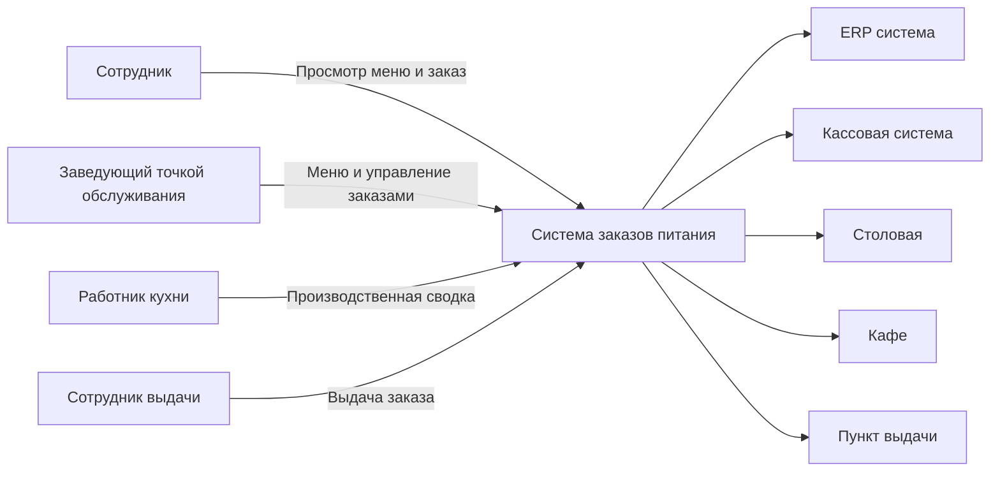
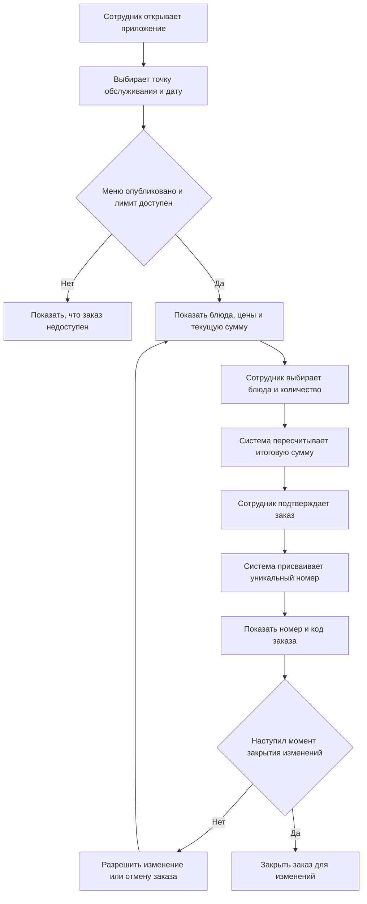
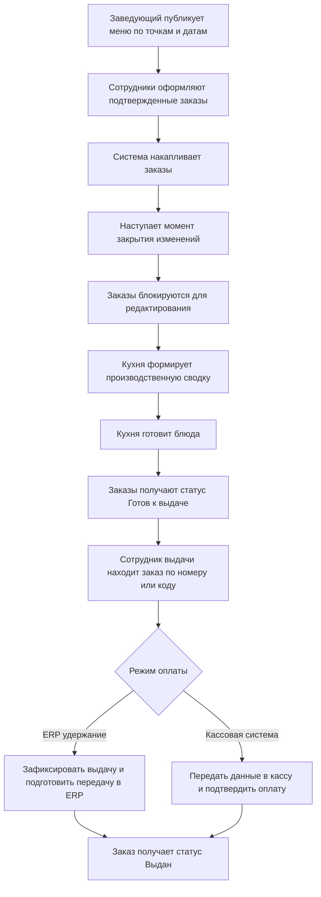
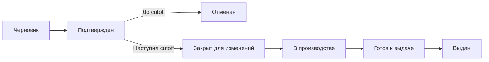

# Система предварительных заказов питания на предприятии

Система должна позволять сотрудникам предприятия заранее просматривать меню на ближайшие дни, выбирать блюда в нужной точке обслуживания и оформлять заказ на получение питания. Основная цель решения — сделать процесс заказа удобным для сотрудника и предсказуемым для столовой, кухни и точки выдачи.

В этом документе столовая, кафе и пункт выдачи далее называются точкой обслуживания. На предприятии может быть несколько точек обслуживания, и у каждой из них могут отличаться меню, цены, время работы, ограничения по количеству заказов и доступность отдельных блюд.

## Назначение

Программа на платформе Naytron должна поддерживать полный бизнес-процесс предварительного заказа питания:

1. сотрудник просматривает меню и оформляет заказ;
2. система показывает стоимость каждой позиции и итоговую сумму заказа;
3. после подтверждения заказ получает уникальный номер;
4. до определенного системой момента заказ можно изменить или отменить;
5. после наступления этого момента заказ уходит в производственный контур и больше не редактируется;
6. готовый заказ выдается по номеру заказа или по коду из приложения сотрудника;
7. после выдачи данные передаются либо в ERP-систему для последующего удержания из заработной платы, либо в кассовую систему для печати чека и оплаты.

## Связь с моделью данных POS-системы

Эта задача должна рассматриваться не как отдельная модель столовой, а как бизнес-сценарий, который использует существующую модель данных POS-системы из пространства имен `pos:`.

1. блюда и напитки должны использовать `sys-ref:Good` и существующую классификацию товаров;
2. меню должно моделироваться через существующие `pos:priceList` и `pos:priceListLine`;
3. итоговый расчет должен оставаться на сущностях `pos:receipt`, `pos:receiptLine` и `pos:receiptPayment`;
4. для сценария столовой должны использоваться уже имеющиеся в модели 0044 универсальные сущности точки обслуживания и предзаказа, а не отдельные специализированные сущности только для питания.

## Интерфейсы и роли

### Сотрудник предприятия

Интерфейс сотрудника должен позволять:

1. просматривать доступные точки обслуживания и дни, на которые опубликовано меню;
2. открывать меню выбранной точки обслуживания;
3. видеть цену каждого блюда и итоговую стоимость заказа;
4. создавать заказ;
5. изменять или отменять заказ до наступления момента закрытия изменений;
6. видеть текущий статус заказа;
7. показывать номер заказа и машиночитаемый код для получения заказа.

### Заведующий точкой обслуживания

Интерфейс заведующего должен позволять:

1. вести меню по каждой точке обслуживания и дате;
2. публиковать и снимать с публикации меню;
3. задавать рабочие параметры точки обслуживания, влияющие на заказ: график работы, доступность, лимиты, ограничения по количеству заказов;
4. просматривать список заказов по точке обслуживания, дате и статусу;
5. переводить заказы по операционным статусам в рамках бизнес-процесса.

### Работник кухни

Интерфейс кухни должен позволять:

1. просматривать список подтвержденных заказов, поступивших в производство;
2. видеть агрегированную потребность по блюдам на дату и точку обслуживания;
3. оформлять производственную заявку или производственную сводку на основании накопленных заказов;
4. отмечать готовность заказов или партий заказов к выдаче.

### Сотрудник выдачи

Интерфейс выдачи должен позволять:

1. находить заказ по уникальному номеру;
2. сканировать код из приложения сотрудника вместо ручного ввода номера;
3. проверять, что заказ находится в статусе, допускающем выдачу;
4. фиксировать факт выдачи заказа;
5. инициировать передачу данных во внешнюю систему оплаты в соответствии с выбранным режимом работы.

### Внешние системы

Решение должно учитывать два альтернативных варианта интеграции:

1. ERP-система: после выдачи заказа фиксируется сумма и факт выдачи, затем эти данные передаются для последующего удержания из заработной платы сотрудника;
2. кассовая система: данные по заказу передаются в кассовую систему для печати чека и подтверждения оплаты.

## Основные бизнес-правила

1. Система показывает сотруднику только те меню, которые опубликованы для выбранной точки обслуживания и даты.
2. Меню каждой точки обслуживания независимо от других точек.
3. Цена блюда определяется в контексте конкретной точки обслуживания и конкретной даты меню.
4. Во время выбора блюд сотрудник должен видеть цену каждой позиции и автоматически пересчитываемую итоговую сумму заказа.
5. При подтверждении заказа система присваивает ему уникальный номер, который используется при получении заказа.
6. Машиночитаемый код в приложении сотрудника должен однозначно идентифицировать этот же номер заказа.
7. В системе действует единое правило момента закрытия изменений заказа. До его наступления заказ можно менять или отменять. После его наступления заказ нельзя редактировать или отменять.
8. После закрытия изменений заказ попадает в производственный контур и должен учитываться кухней при формировании производственной потребности.
9. У каждой точки обслуживания могут отличаться:
   - состав меню;
   - цены;
   - время работы;
   - лимит общего количества заказов;
   - доступность отдельных блюд.
10. Если лимит заказов для точки обслуживания или блюда исчерпан, система не должна позволять оформить новый заказ или добавить недоступную позицию.
11. Выдача заказа допускается только для заказа, который подготовлен к выдаче и не был ранее выдан или отменен.
12. При внедрении выбирается один из двух поддерживаемых режимов работы: ERP-удержание или кассовая оплата.
13. В режиме ERP-удержания факт выдачи является основанием для передачи данных о сумме заказа во внешнюю ERP-систему.
14. В режиме кассовой оплаты выдача заказа должна сопровождаться передачей данных в кассовую систему для печати чека и подтверждения оплаты.

## Контекст взаимодействия

## Сценарии использования

### Сценарий 1: Оформление заказа сотрудником

1. Сотрудник авторизуется в приложении и попадает на экран выбора точки обслуживания и даты.
2. Система показывает только те даты и точки обслуживания, по которым опубликовано меню и есть доступная квота заказов.
3. После выбора даты сотрудник видит список блюд с ценами.
4. По мере выбора блюд система пересчитывает общую стоимость заказа.
5. После подтверждения система присваивает заказу уникальный номер.
6. Пока не наступил момент закрытия изменений, сотрудник может вернуться в заказ, изменить состав блюд или отменить заказ.
7. После наступления момента закрытия изменений сотрудник может только просматривать заказ и использовать его номер или код для получения.

### Сценарий 2: Операционный процесс точки обслуживания

1. Заведующий заранее публикует меню для каждой точки обслуживания и даты.
2. В течение периода приема заказов сотрудники оформляют и при необходимости меняют свои заказы.
3. После закрытия изменений кухня получает актуальный набор заказов, который уже не должен меняться.
4. На основании заказов кухня формирует производственную сводку по блюдам.
5. После приготовления заказ или группа заказов переводится в статус готовности к выдаче.
6. На выдаче заказ идентифицируется по номеру или по сканированию кода из приложения сотрудника.
7. Далее выполняется сценарий оплаты, соответствующий выбранному режиму внедрения.

### Сценарий 3: Жизненный цикл заказа

Изменение состава блюд до момента закрытия изменений не обязано создавать отдельный бизнес-статус. Заказ может оставаться в статусе `Подтвержден`, пока сотрудник меняет его содержимое в допустимый период.

### Сценарий 4: Выдача заказа

1. Сотрудник приходит в точку выдачи и показывает номер заказа или код из приложения.
2. Сотрудник выдачи находит заказ вручную или сканированием.
3. Система проверяет, что заказ не отменен, не выдан ранее и находится в статусе, допускающем выдачу.
4. Если используется ERP-режим, после выдачи формируется запись для передачи суммы заказа и факта выдачи в ERP.
5. Если используется кассовый режим, данные заказа передаются в кассовую систему для печати чека и подтверждения оплаты.
6. После успешного завершения соответствующего сценария заказ получает статус `Выдан`.

## Статусы заказа

| Статус | Смысл |
|------|------|
| `Черновик` | Сотрудник еще не завершил оформление заказа. Такой заказ не участвует в производстве. |
| `Подтвержден` | Заказ создан, номер присвоен, до наступления момента закрытия изменений его еще можно менять или отменять. |
| `Закрыт для изменений` | Период редактирования завершен, заказ зафиксирован для кухни. |
| `В производстве` | Заказ участвует в приготовлении. |
| `Готов к выдаче` | Заказ собран и может быть выдан сотруднику. |
| `Выдан` | Заказ фактически получен сотрудником, данные по оплате переданы по выбранному сценарию. |
| `Отменен` | Заказ отменен до передачи в производственный контур. |

## Концептуальная модель данных

При проектировании этой задачи не нужно вводить отдельное пространство имен `canteen:`. Для ее реализации должны использоваться сущности пространства имен `pos:` и системные сущности из `sys:` и `sys-ref:` по правилам документа `doc\0000-0050\0044.pos-system-max-db.md`.

Ниже слово `меню` используется как бизнес-термин. В терминах модели 0044 меню должно моделироваться как опубликованный `pos:priceList`, а позиции меню — как `pos:priceListLine`.

### Готовые сущности из `sys:`

| Сущность | Как используется в задаче |
|------|------|
| `sys:User` | Используется для всех участников процесса: сотрудник предприятия, заведующий точкой обслуживания, работник кухни, сотрудник выдачи. Также через эту сущность фиксируются пользователь, оформивший заказ, и пользователь, подтвердивший выдачу. |

### Готовые сущности из `sys-ref:`

| Сущность | Как используется в задаче |
|------|------|
| `sys-ref:Good` | Используется как карточка блюда, напитка или другого товара, доступного для предзаказа. |
| `sys-ref:GroupHierarchy` | Используется как иерархия навигации меню, если меню показывается по группам. |
| `sys-ref:GoodGroup` | Используется как категория меню, например первое, второе, напитки, выпечка. |
| `sys-ref:GoodGroupMembership` | Используется для связи блюда или товара с категорией меню. |
| `sys-ref:Organization` | Используется как организационный и юридический контур предприятия или точки обслуживания. |
| `sys-ref:Department` | Может использоваться для аналитики, ограничений или интеграции с ERP по подразделениям сотрудников. |

### Готовые сущности из `pos:`

| Сущность | Как используется в задаче |
|------|------|
| `pos:servicePoint` | Используется как карточка точки обслуживания или выдачи: столовая, кафе, магазин, пункт выдачи. |
| `pos:priceList` | Используется как опубликованное меню точки обслуживания на дату или период действия. |
| `pos:priceListLine` | Используется как позиция меню с ценой и ограничением по количеству, доступному к предзаказу. |
| `pos:salesOrder` | Используется как документ предзаказа до итогового расчета и выдачи. |
| `pos:salesOrderLine` | Используется как строка предзаказа с товаром, количеством и ценой на момент оформления. |
| `pos:terminal` | Может использоваться как устройство выдачи или расчета, связанное с точкой обслуживания. |
| `pos:receipt` | Используется как итоговый расчетный документ в сценарии, где выдача сопровождается оформлением чека. |
| `pos:receiptLine` | Используется как строка итогового расчетного документа. |
| `pos:receiptPayment` | Используется для фиксации факта и способа оплаты в кассовом сценарии. |
| `pos:paymentForm` | Используется как базовая форма расчета в кассовом сценарии. |
| `pos:paymentType` | Используется как конкретный тип оплаты в итоговом чеке. |

### Основные связи

1. Блюда и напитки хранятся в `sys-ref:Good` и при необходимости группируются через `sys-ref:GroupHierarchy`, `sys-ref:GoodGroup` и `sys-ref:GoodGroupMembership`.
2. Одна точка обслуживания (`pos:servicePoint`) может иметь несколько опубликованных прайс-листов или меню на разные даты и периоды.
3. Один прайс-лист (`pos:priceList`) содержит много позиций (`pos:priceListLine`).
4. Один предзаказ (`pos:salesOrder`) относится к одному сотруднику или клиенту, одной точке обслуживания и одному опубликованному прайс-листу.
5. Один предзаказ содержит много строк (`pos:salesOrderLine`).
6. После выдачи и расчета предзаказ может быть связан с итоговым чеком (`pos:receipt`).
7. Производственная сводка кухни рассматривается как производная проекция от предзаказов и их строк. В модели 0044 для этого не требуется отдельная сущность только для столовой.

## Границы задачи и допущения

1. В рамках этой постановки описывается бизнес-процесс заказа и выдачи питания, а не технический протокол интеграции.
2. В задачу не входят учет складских остатков, рецептуры, технологические карты и закупка продуктов.
3. В задачу не входит расчет заработной платы. ERP-система рассматривается как внешний получатель данных о факте выдачи и сумме удержания.
4. В задачу не входит описание конкретного кассового оборудования и конкретного фискального протокола.
5. В задачу не входит обслуживание за столом, учет посадочных мест и ресторанный сценарий с официантами.
6. Если точка обслуживания является только пунктом выдачи, логистика подвоза готовых блюд к ней находится вне текущей постановки.

## Критерии приемки

1. В документе описаны все четыре требуемые рабочие роли: сотрудник, заведующий точки обслуживания, кухня и выдача.
2. В документе явно зафиксировано наличие нескольких точек обслуживания с разными меню, ценами, графиками и лимитами.
3. Для сотрудника описан сценарий выбора точки обслуживания, даты, блюд и подтверждения заказа.
4. В документе прямо указано, что сотрудник видит цену каждой позиции и итоговую стоимость заказа.
5. В документе прямо указано, что при подтверждении заказ получает уникальный номер.
6. В документе прямо указано, что до единого системного момента закрытия изменений заказ можно изменить или отменить, а после этого нельзя.
7. В документе описан сценарий кухни с формированием производственной сводки по сделанным заказам.
8. В документе описан сценарий выдачи по номеру заказа и по сканированию кода.
9. В документе поддержаны оба варианта оплаты: передача данных в ERP для удержания из заработной платы и передача данных в кассовую систему для печати чека и оплаты.
10. В документе зафиксировано, что задача использует [doc/0000-0050/0044.pos-system-max-db.md](doc/0000-0050/0044.pos-system-max-db.md) как уже существующую базовую модель данных POS-системы, а не создает отдельную предметную модель столовой.
11. В документе зафиксировано, что меню моделируется через `pos:priceList` и `pos:priceListLine`, а итоговый расчет остается на `pos:receipt*`.
12. В документе зафиксировано, что сценарий предзаказа опирается на уже существующие универсальные POS-сущности точки обслуживания и заказа, а не на специализированные сущности только для столовой.
13. В документе присутствуют Mermaid-диаграммы, отражающие контекст ролей, сценарий оформления заказа, операционный поток и жизненный цикл заказа.

